# codex-deepseek

**让真正的 OpenAI Codex CLI 跑 DeepSeek 模型，同时 ChatGPT 桌面版和原来的 `codex` 命令都照旧使用自己的登录、模型和配置，完全不受影响。**

[](https://github.com/mlangTse/codex-deepseek/actions/workflows/build.yml)
[](LICENSE)
[](#环境要求)

[English](README.md) · [架构说明](docs/architecture.md)

<p align="center">
  
</p>

---

## 解决什么问题

Codex 桌面版和 `codex` 命令行是**同一个 Codex home 的两个前端**：都读 `~/.codex/config.toml`，都在那里找凭据，也都把会话存在那里。所以一旦你把这份共享配置指向第三方 provider：

```toml
model = "deepseek-flash"
model_provider = "deepseek"
```

两个前端会一起变：

- **ChatGPT 桌面版**：模型选择器里没有 ChatGPT 模型了、要求重新登录，或者登录界面一直转圈加载。
- **原来的 `codex` CLI**：不再走你的 ChatGPT 账号，同样去打 DeepSeek 端点 —— 连 `~/.codex/sessions` 里已有的会话也一起受影响。

两边都不是「重试一下」能解决的：ChatGPT 订阅不能服务 `deepseek-*` 模型，DeepSeek 的 key 也不能服务 `gpt-*`。于是就有了「同一份文件来回改、改完还要重启/重新登录」的循环 —— 这个项目终结这个循环：

```text
                        你的电脑
                            |
             +--------------+---------------+
             |                              |
     ChatGPT 桌面版                   codex-deepseek
     + 原来的 `codex` CLI             （本项目）
             |                              |
        ~/.codex                    ~/.codex-deepseek
             |                              |
   ChatGPT 登录 / 订阅               你自己的 DeepSeek API Key
             |                              |
   GPT / Codex 模型               deepseek-flash, deepseek-v4-pro
```

（Windows 上 `~/.codex` 就是 `%USERPROFILE%\.codex`。）

关键是那个启动器：它用显式重写过的 `CODEX_HOME` 去启动**真正的** `codex`，所以无论全局配置怎么写、PATH 怎么排、环境变量怎么传，DeepSeek 的设置都不可能漏进 ChatGPT 桌面版，也不可能漏进原来的 `codex` 命令。

### 哪些东西完全没被动过

| 使用者 | Codex home | 凭据 | 模型 |
|---|---|---|---|
| ChatGPT 桌面版 | `~/.codex` | ChatGPT 登录 | GPT / Codex |
| `codex`（原来的 CLI） | `~/.codex` | ChatGPT 登录 | GPT / Codex |
| `codex-deepseek` | `~/.codex-deepseek` | DeepSeek API Key | `deepseek-flash`、`deepseek-v4-pro` |

本项目从不写 `~/.codex`。原来的 CLI 保留自己的配置、自己的凭据、自己的 `~/.codex/sessions` 历史，所以 `codex`、`codex resume`、`codex exec` 的行为和以前完全一样：同一个 ChatGPT 账号、同一批模型，不用重新登录、不用重启。

唯一会破坏这个隔离的做法，是把自定义 `model_provider` 写回**全局** `~/.codex/config.toml` —— 那正是这个项目要避开的东西，参见[常见故障对照表](#常见故障对照表)。

## 仓库内容

| 路径 | 作用 |
|---|---|
| `install.ps1` / `build.ps1` | Windows：用系统自带的 `csc.exe` 编译启动器（**不需要 .NET SDK、不需要 NuGet、不需要装运行时**），建 home、写配置、更新用户 PATH。 |
| `install.sh` | macOS / Linux：安装 POSIX 启动器、建 home、写配置、往 shell rc 追加一行 PATH。 |
| `src/CodexDeepSeek.cs` | Windows 启动器：命令行引号处理、继承标准句柄、kill-on-close Job Object。 |
| `src/codex-deepseek.sh` | macOS / Linux 启动器：约 90 行 POSIX `sh`，零依赖。 |
| `config/models.json` | 通过 `model_catalog_json` 钉给 CLI 的模型目录。 |

## 环境要求

| | |
|---|---|
| Windows | Windows 10/11，PowerShell 5.1 以上（用系统自带的 .NET Framework 编译器）。 |
| macOS / Linux | POSIX `sh` 与 `bash`；安装脚本用到 `install`、`sed`、`mktemp`。 |
| 通用 | 已装好可用的 Codex CLI（`codex --version`），以及能访问 `config/models.json` 里那些模型的 DeepSeek API Key。 |

## 快速开始

### Windows

**方案 A —— 本地编译**（两秒钟，不需要 SDK）：

```powershell
git clone https://github.com/mlangTse/codex-deepseek.git
cd codex-deepseek

# 编译启动器 + 创建 ~\.codex-deepseek + 写入 PATH
pwsh -File .\install.ps1

# 安装脚本会问你的 DeepSeek API Key（也可以用 -ApiKey 或 $env:DEEPSEEK_API_KEY）
```

没有 PowerShell 7 就用 `powershell -ExecutionPolicy Bypass -File .\install.ps1`。

**方案 B —— 不编译**：从 [latest release](https://github.com/mlangTse/codex-deepseek/releases/latest) 下载 `codex-deepseek.exe`（Windows x64，附 `SHA256SUMS.txt`），放进 `%USERPROFILE%\.codex-deepseek\bin`，然后照下面手动安装的第 2～4 步做。

### macOS / Linux

```sh
git clone https://github.com/mlangTse/codex-deepseek.git
cd codex-deepseek

# 安装启动器、创建 ~/.codex-deepseek、写配置，
# 并往 ~/.zshrc 或 ~/.bashrc 追加一行 PATH
./install.sh

# 安装脚本会问你的 DeepSeek API Key
# （也可用 DEEPSEEK_API_KEY=... ./install.sh 或 ./install.sh --api-key ...）
```

常用参数：`--home DIR`、`--model SLUG`、`--reasoning-effort LEVEL`、`--base-url URL`、`--no-path`、`--force`，完整列表见 `./install.sh --help`。

不需要下载二进制：POSIX 启动器本身就是可直接执行的 shell 脚本。

### 之后（三个平台一样）

```sh
codex-deepseek --version      # -> codex-cli <版本>（真 CLI，不是重写的实现）
codex-deepseek exec "打印当前日期"
```

原来的 `codex` 命令完全不受影响：同一个 ChatGPT 账号、同一批模型、同一份会话历史，不用重新登录也不用重启。

### 手动安装（想逐步确认时）

```sh
# 1. 拿到启动器
git clone https://github.com/mlangTse/codex-deepseek.git && cd codex-deepseek
#    Windows：pwsh -File .\build.ps1  -> dist\codex-deepseek.exe
#    macOS/Linux：无需编译，直接用 src/codex-deepseek.sh

# 2. 建立独立的 Codex home
mkdir -p ~/.codex-deepseek/bin
cp config/models.json          ~/.codex-deepseek/models.json
cp config/config.toml.example  ~/.codex-deepseek/config.toml
cp src/codex-deepseek.sh       ~/.codex-deepseek/bin/codex-deepseek
chmod 755 ~/.codex-deepseek/bin/codex-deepseek

# 3. 编辑 ~/.codex-deepseek/config.toml，把占位符换成你的值
#    （model、目录路径、base URL、bearer token）

# 4. 把启动器加入 PATH（只需一次）
echo 'export PATH="$HOME/.codex-deepseek/bin:$PATH"' >> ~/.zshrc   # 或 ~/.bashrc
```

## 配置说明

`~/.codex-deepseek/config.toml` 就是全部，它永远不会碰到桌面版：

```toml
model = "deepseek-flash"
model_provider = "deepseek"
model_catalog_json = "/Users/<你>/.codex-deepseek/models.json"
model_reasoning_effort = "high"
web_search = "disabled"
preferred_auth_method = "apikey"
forced_login_method = "api"

[model_providers.deepseek]
name = "deepseek"
base_url = "https://api.deepseek.com/"
wire_api = "responses"
experimental_bearer_token = "<你的 DeepSeek API Key>"
```

这几行都是踩过坑才留下的：

- **`model_catalog_json` 不能省。** 没有它，CLI 用二进制里内置的 OpenAI 目录，任务会直接报 `The 'deepseek-flash' model is not supported when using Codex with a ChatGPT account.`
- **`forced_login_method = "api"` + `preferred_auth_method = "apikey"`** 阻止 CLI 去弹 ChatGPT 浏览器登录；这个 home 故意没有 `auth.json`。
- **`web_search = "disabled"`**，因为第三方网关不提供托管的搜索工具。
- 不要写 `service_tier`，第三方网关会直接返回 `400`。
- Windows 上路径用正斜杠或转义反斜杠；macOS/Linux 用普通绝对路径。
- 这个文件里是明文 bearer token，别提交到仓库。两个安装脚本都不会把 Key 回显出来，`.gitignore` 也已经排除 `config.toml`（macOS/Linux 下安装脚本会把权限设成 `600`）。

### 模型列表从哪来

模型选择完全由 `model_catalog_json` → `config/models.json` 决定，改完重启 CLI 即生效，不需要重新编译：

```sh
codex-deepseek exec "你现在是哪个模型？"
```

要针对新的 CLI 版本重新生成目录，就从内置目录出发并保留那些长 instructions 字段：

```sh
codex debug models --bundled > "$TMPDIR/bundled.json"
# 保留一个条目做模板，改 slug / display_name / supported_reasoning_levels
```

## 日常使用

```sh
codex-deepseek                      # 交互式 TUI，跑 DeepSeek
codex-deepseek exec "fix the tests"
codex-deepseek resume               # 会话存在 ~/.codex-deepseek/sessions
codex-deepseek --version

codex                               # 保持原样：ChatGPT 账号
```

两个安装脚本都会在启动器旁边放一个短别名：macOS/Linux（以及 Git Bash）用 `cx`，Windows 的 cmd 用 `cx.cmd`。

```sh
cx exec "解释一下这个仓库"
```

## 常见故障对照表

| 现象 | 原因 | 处理 |
|---|---|---|
| 桌面版要求重新登录，或登录界面一直转圈 | 全局 `~/.codex/config.toml` 里写了自定义 `model_provider` | 从 `~/.codex/config.toml` 删掉 `model` / `model_provider` / `model_catalog_json` / `[model_providers.*]`，只保留在 `~/.codex-deepseek/config.toml` |
| 网关返回 `400`，body 为空 | 请求里带了 `service_tier = "default"` | DeepSeek home 里不要设 `service_tier` |
| `model_reasoning_effort = "xhigh"` 被拒 | 目录里没有该档位 | 用 `high`，或在 `models.json` 里补上档位 |
| 报 `... not supported when using Codex with a ChatGPT account` | 这一轮跑的是 ChatGPT home 下的真 `codex` | 你执行的是 `codex` 而不是 `codex-deepseek`，或者 DeepSeek 配置漏进了 `~/.codex` |
| `codex-deepseek: cannot find the real codex executable` | 找不到 Codex 安装 | 把 `CODEX_DEEPSEEK_TARGET` 设为 Codex 可执行文件的完整路径 |
| `codex-deepseek: missing DeepSeek config at ...` | 独立 home 里没有 `config.toml` | 跑安装脚本，或手工创建 |
| `codex-deepseek debug models --bundled` 显示的是 OpenAI 模型 | v0.2.0 起启动器原样转发，不再自己回答这条命令 | 属于预期行为；选模型靠的是 `model_catalog_json`，不是这条命令 |
| 取消任务后 `codex` 残留（Windows） | — | 不会发生：子进程在 kill-on-close 的 Job Object 里 |

### 关于过去的一个说明

早期版本的启动器还会拦截 `codex debug models --bundled`，向第三方工具广告一份 DeepSeek 专用目录。该功能已在 v0.2.0 移除：现在启动器原样转发所有参数，只做「钉住 `CODEX_HOME`」这一件事，日常 CLI 使用行为不变。

## 许可

[MIT](LICENSE)。与 OpenAI、DeepSeek 均无隶属关系；Codex 是 OpenAI 的商标。
